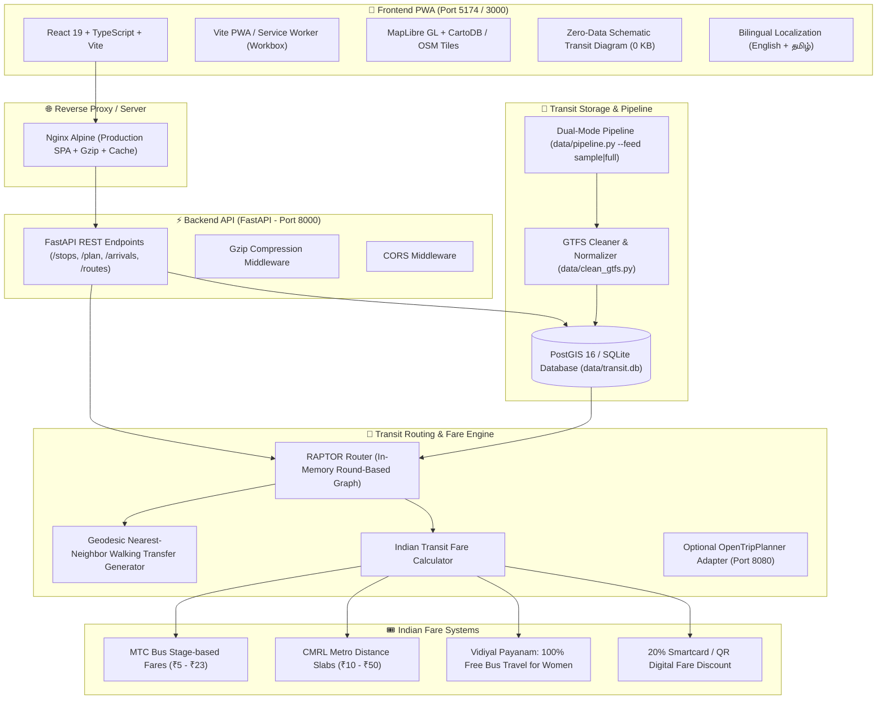

# Transit Assist India — Chennai Bus & Metro Assistant

> **A fast, low-data, multilingual public transit assistant web app (PWA) for Indian commuters.**  
> Built for **Chennai** supporting **MTC City Buses** and **CMRL Metro** in **English** and **Tamil (தமிழ்)** with 100% free/open-source tools and zero paid map APIs.

---

## 🏛️ Architecture Overview



---

## ✨ Key Capabilities

1. **Multimodal Journey Planning (RAPTOR)**:
   - High-performance, round-based Pareto exploration calculating earliest arrival, minimum transfers, and inter-modal walking transfers between MTC bus stops and CMRL metro stations.
   - Sub-50ms query latency running entirely in-memory with zero external routing API dependencies.

2. **Native Indian Fare Calculations**:
   - **MTC City Buses**: Exact stage-based fare matrices (₹5 base for Ordinary, progressive slabs up to ₹23 for Deluxe/Express).
   - **CMRL Metro**: Accurate distance-slab fare tables (₹10 to ₹50).
   - **Tamil Nadu *Vidiyal Payanam* Scheme**: 100% free bus fare calculation toggle for female passengers on ordinary city buses.
   - **Digital Fare Discounts**: Automatic 20% savings breakdown for Metro Smartcards and QR tickets.

3. **Bilingual Search & Localization**:
   - Dynamic toggle between **English** and **Tamil (தமிழ்)** across all navigation controls, line names, and stops.
   - Prefix and fuzzy autocomplete supporting Tamil script (e.g. `சென்னை சென்ட்ரல்`, `விமான நிலையம்`).

4. **Low-Data & Offline Capabilities**:
   - **Zero-Data Schematic Diagram**: Interactive HTML5 SVG/Canvas transit schematic line map requiring 0 KB of tile downloads.
   - **PWA Service Worker**: Automatic offline caching of application shell, fonts, stop databases, and visited map tiles.
   - **Gzip API Payloads**: All JSON endpoints compressed via GZip middleware for optimal responsiveness on 2G/3G connections.

5. **100% Open-Source & Free-Tier Friendly**:
   - Zero Google Maps or Mapbox API keys required.
   - MapLibre GL map engine paired with CartoDB Dark Matter raster tiles and OpenStreetMap data.

---

## 🚀 Quickstart

### Option 1: 1-Command Docker Compose (Recommended)

Requires [Docker Desktop](https://www.docker.com/products/docker-desktop/):

```bash
# Clone and launch all services (PostGIS + FastAPI + React Nginx)
docker compose up --build
```

- **Frontend Web App:** [http://localhost:3000](http://localhost:3000)
- **FastAPI Backend:** [http://localhost:8000](http://localhost:8000)
- **Swagger API Documentation:** [http://localhost:8000/docs](http://localhost:8000/docs)

---

### Option 2: Local Development Setup

#### 1. Backend Setup (Python 3.11+)

```bash
# Navigate to project root
cd "Transit Assit"

# Create and activate virtual environment
python -m venv backend/.venv
# Windows:
.\backend\.venv\Scripts\activate
# Linux/macOS:
source backend/.venv/bin/activate

# Install dependencies
pip install -r backend/requirements.txt

# Ingest transit data into SQLite database
python data/pipeline.py --feed sample

# Start FastAPI development server
python -m uvicorn backend.app.main:app --host 0.0.0.0 --port 8000 --reload
```

#### 2. Frontend Setup (Node.js 20+)

```bash
# Navigate to frontend folder in a new terminal
cd frontend

# Install npm dependencies
npm install

# Start Vite dev server with proxy
npm run dev
```

- **Local Frontend Dev URL:** [http://localhost:5173](http://localhost:5173) (or [http://localhost:5174](http://localhost:5174))

---

## 🧪 Automated Testing & Demonstration

### Run Live Interactive CLI Demo

Run the automated test demonstration showing health checks, bilingual searches, spatial nearest-neighbor queries, and RAPTOR route planning:

```bash
# Windows PowerShell:
.\demo.ps1

# Linux / macOS:
./demo.sh

# Or directly with Python:
python demo.py
```

### Run Backend Unit & Integration Tests

```bash
# Run 57 automated tests covering API, RAPTOR routing, fares, accessibility, ML delay predictor, and real-time tracking
pytest
```

---

## 🔌 API Reference

| Method | Endpoint | Description | Sample Query / Body |
|---|---|---|---|
| `GET` | `/api/health` | Network status, active modes, total stops & routes | `GET /api/health` |
| `GET` | `/api/stops` | Bilingual stop search and autocomplete | `GET /api/stops?query=Central&limit=5` |
| `GET` | `/api/stops/nearby` | Spatial nearest-neighbor stop lookup | `GET /api/stops/nearby?lat=13.0827&lon=80.2754&radius=1000` |
| `GET` | `/api/arrivals` | Live scheduled arrivals and ETA countdown | `GET /api/arrivals?stop_id=ST_CENTRAL&limit=5` |
| `POST` | `/api/plan` | Multimodal journey planning with fare breakdown | `POST /api/plan` with JSON coordinates |
| `GET` | `/api/routes/{id}` | Route polylines and stop sequences | `GET /api/routes/CMRL_BLUE` |
| `POST` | `/api/reports` | Submit commuter crowd & service delay report | `POST /api/reports` with JSON payload |
| `GET` | `/api/reports/summary/{id}` | Real-time consensus crowd level & average delay | `GET /api/reports/summary/SR_SOUTH` |
| `GET` | `/api/realtime/vehicles` | Real-time active vehicle positions & bearing | `GET /api/realtime/vehicles?time=08:30:00` |
| `GET` | `/api/realtime/trip-updates` | Real-time GTFS-RT trip delays & stop updates | `GET /api/realtime/trip-updates?time=08:30:00` |
| `GET` | `/api/realtime/gtfs-rt` | Full GTFS-RT 2.0 FeedMessage JSON | `GET /api/realtime/gtfs-rt?time=08:30:00` |
| `GET` | `/api/predict/delay` | AI arrival delay & bilingual commuter advisory | `GET /api/predict/delay?route_id=CMRL_BLUE&weather=monsoon` |
| `GET` | `/api/predict/corridors` | Chennai flood-prone corridors & delay summary | `GET /api/predict/corridors?weather=monsoon` |
| `GET` | `/api/accessibility/stations` | Station elevator counts, ramps, tactile paving | `GET /api/accessibility/stations?mode=METRO` |
| `GET` | `/api/accessibility/stations/{id}` | Specific station step-free accessibility details | `GET /api/accessibility/stations/ST_CENTRAL` |

### Sample Journey Plan Request (`POST /api/plan`)

```json
{
  "origin_lat": 13.0827,
  "origin_lon": 80.2754,
  "destination_lat": 12.9856,
  "destination_lon": 80.1636,
  "departure_time": "08:30:00",
  "is_female": false,
  "max_transfers": 3
}
```

---

## 🗺️ Transit Data & Ingestion

### Sample vs. Full Feed Swapping

The pipeline supports both an instant offline sample dataset and real full-city GTFS feeds:

- **Sample Feed (Default)**: Located in `data/sample/`. Includes 31 key stations, 9 routes (CMRL Blue & Green Lines, Suburban South EMU, MRTS Velachery, MTC Bus 29C, 18A, 47A, 23C, 11G), 1,138 trips, and 7,952 stop times across Chennai Central, Airport, Koyambedu CMBT, T. Nagar, Tambaram, and Adyar corridors.
  ```bash
  python data/pipeline.py --feed sample
  ```
- **Full Feed**: Ingests real 9MB MTC bus + CMRL metro GTFS archives:
  ```bash
  python data/pipeline.py --feed full
  ```

### Data Sources & Licensing

- **Chennai GTFS**: Aggregated and curated by `UngalSoththu / ChennaiGTFS` under Open Data Commons (ODbL / PDDL).
- **Map Tiles**: CartoDB Dark Matter / OpenStreetMap (Open Database License).
- **Icons**: Lucide Icons (ISC License).

---

## 📱 Mobile & PWA Verification

Transit Assist India has been verified across responsive viewports down to 375px/390px smartphone screens, featuring touch-friendly chips, expandable step-by-step itineraries, 1-tap WhatsApp sharing, emergency SOS helplines, and zero horizontal overflow.

---

## 🔮 Future Roadmap

- [x] **Suburban Rail Integration**: Southern Railway Chennai Beach – Tambaram and MRTS line schedules with Indian Railways second-class slab fares.
- [x] **Crowd & Delay Reporting**: Community-driven reporting for bus, metro, and suburban train occupancy with live consensus badges.
- [x] **Voice Search**: Speech recognition for commuters speaking Tamil or Indian English.
- [x] **Commuter Safety SOS**: 1-tap WhatsApp trip sharing & direct dial to Chennai Police (100) & Women Helpline (1091).
- [x] **Real-time Vehicle Tracking**: In-memory high-frequency GPS tracking and GTFS-RT FeedMessage standard generation with live MapLibre bearing compass indicators and low-data throttling.
- [x] **Predictive Machine Learning**: Historical arrival delay prediction model under varying Chennai monsoon and traffic conditions.
- [x] **Saved Places & Commute Hubs**: 1-tap bookmarks for Home, Work, and starred daily journeys with full offline persistence.
- [x] **Step-Free Accessibility & Wheelchair Routing**: Station elevator directories and wheelchair accessible route filtering.
- [x] **Live Departure Alarms**: In-browser audio countdown chimes and departure alerts before upcoming transit connections.
- [x] **Admin Transit Operations Center & Live Disruption Broadcasting**: Network telemetry console, multi-mode fleet trackers, OTP punctuality gauges, and real-time incident broadcaster alerting commuter PWAs.

---

## 🧪 Comprehensive Automated Test Suite (61 Tests)

```bash
pytest backend/tests/
# ======================== 61 passed, 1 warning in 3.27s ========================
```
- `test_accessibility_and_saved.py` (Phase 11): Step-free stations directory, wheelchair routing, saved hubs.
- `test_admin_dashboard.py` (Phase 12): Operations metrics, fleet telemetry, incident broadcasting & resolution.
- `test_ml_predictor.py` (Phase 10): Delay prediction & monsoon corridor intelligence.
- `test_realtime.py` (Phase 9): Vehicle simulation & GTFS-RT feed generation.
- `test_fares.py`: MTC stage fares, CMRL distance slabs, Vidiyal Payanam, digital discounts.
- `test_multimodal.py`: RAPTOR transfers, suburban rail, multimodal routing.
- `test_routing.py`: Earliest arrival, transfer minimizer, Pareto exploration.
- `test_api.py`: REST endpoint verification, GZip compression, health check.
- `test_data_cleaning.py`: GTFS ingestion & data normalization.

